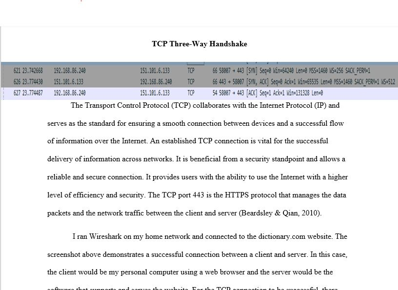
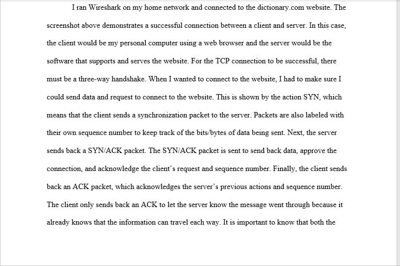
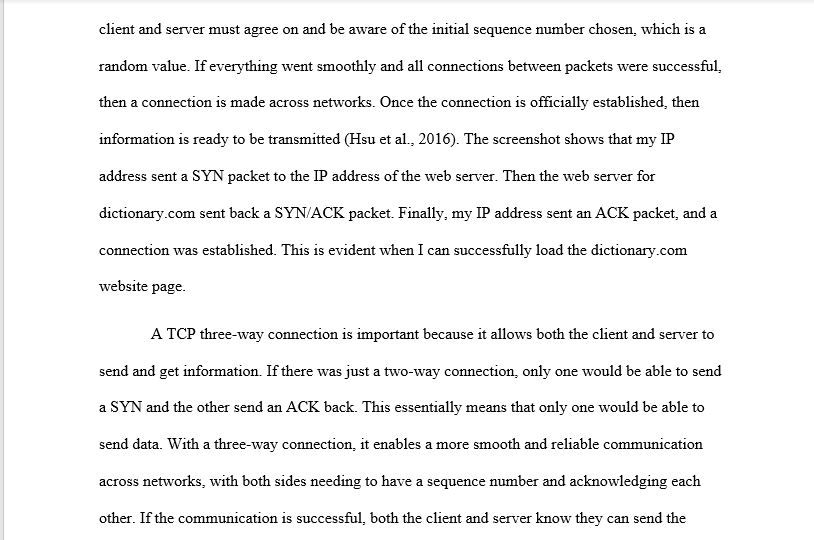
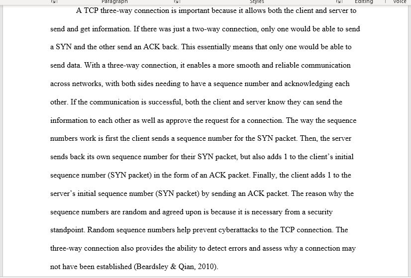
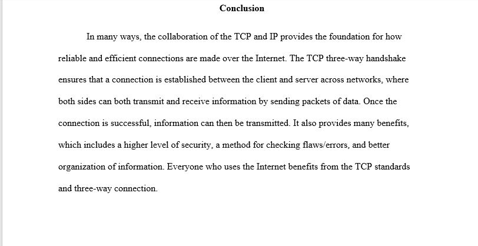

# Wireshark

I analyzed traffic and packet capture when running a website through Wireshark. The goal was to analyze packets, understand the client-server relationship, how traffic flows in a network, and what the bits/bytes look like. Attached below is a screenshot of a TCP three-way handshake when connected to a website on Wireshark, and an explanation of the client-server relationship.

